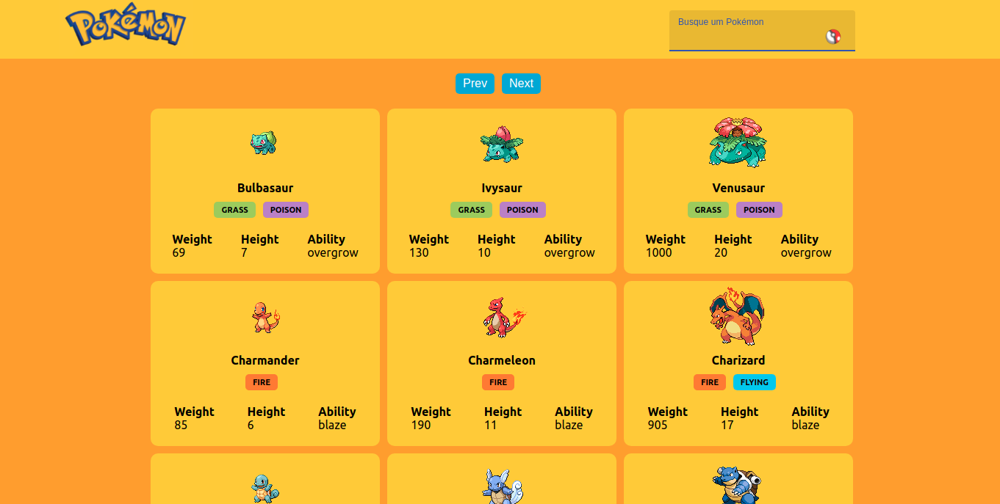

# Pokedex XP

<div id="top" align="center">
  
  

  [](https://github.com/L5-Team/Pokedex/actions/workflows/main.yml)
  
   [Demo](https://l5-team.github.io/Pokedex/#/)
  
</div>



> Pokedex criada utilizando React.js e a [PokéApi](https://pokeapi.co/)

### Ajustes e melhorias

O projeto ainda está em desenvolvimento e as próximas atualizações serão voltadas nas seguintes tarefas:

- [x] Lista de todos os Pokemons
- [x] Navegação
- [ ] Busca por nome
- [ ] Filtro por Região e tipo
- [ ] Modal com detalhes de cada Pokemon

## 🚀 Instalando a Pokedex!

Para instalar o projeto, siga estas etapas:

* Clone o projeto usando o comando:
```
git clone git@github.com:L5-Team/Pokedex.git
```
* Dentro da pasta do projeto,utilize o comando:

```
npm install
```

## ☕ Usando a Pokedex

Para usar o projeto, siga estas etapas:

```
npm start
```

Irá abrir uma nova aba do seu navegador com o projeto!

## 📫 Contribuindo para o projeto!

Para contribuir com o projeto, siga estas etapas:

1. Bifurque este repositório.
2. Crie um branch: `git checkout -b <nome_branch>`.
3. Faça suas alterações e confirme-as: `git commit -m '<mensagem_commit>'`
4. Envie para o branch original: `git push origin Pokedex / <local>`
5. Crie a solicitação de pull.

Como alternativa, consulte a documentação do GitHub em [como criar uma solicitação pull](https://help.github.com/en/github/collaborating-with-issues-and-pull-requests/creating-a-pull-request).

## 🤝 Colaboradores

Agradecemos às seguintes pessoas que contribuíram para este projeto:

<table>
  <tr>
    <td align="center">
      <a href="https://github.com/LucasAlvaresA">
        <br>
        <sub>
          <b>Lucas Álvares</b>
        </sub>
      </a>
    </td>
  </tr>
</table>

[⬆ Voltar ao topo](#top)<br>
